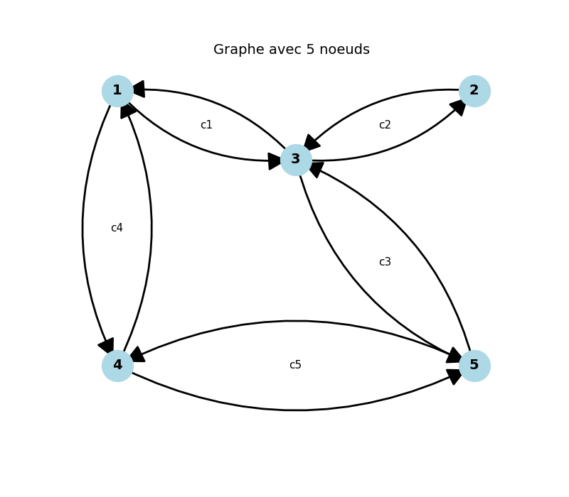

# 3. Leader election in General Synchronous Graphs
## 1/

  

L’algorithme a été correctement implémenté et testé sur un graphe général à 5 nœuds.
Pour assurer son bon fonctionnement, plusieurs choix d’implémentation ont été nécessaires :

Utilisation d’un double canal par arête : chaque lien entre deux nœuds est représenté par deux canaux, un pour chaque sens de communication. Cela évite qu’un nœud puisse « relire » ses propres messages et garantit une propagation claire et bidirectionnelle des informations.

Envoi initial du propre identifiant de chaque nœud : au démarrage, chaque nœud diffuse immédiatement son identifiant sur ses canaux sortants. Cela permet de lancer le processus et d’assurer qu’il y a toujours un message disponible au premier tour pour chaque voisin.

Buffer de taille 1 sur chaque canal : ce choix permet de ne pas bloquer dès l’envoi initial, tout en respectant la logique d’un système synchrone où chaque nœud attend de recevoir un message de ses voisins à chaque tour.

Grâce à ces ajustements, après un nombre de tours égal au diamètre du graphe (ici 3), tous les nœuds convergent correctement vers la même valeur maximale, et seul le nœud portant l’identifiant le plus élevé (nœud 5) est élu leader, conformément à l’algorithme attendu.